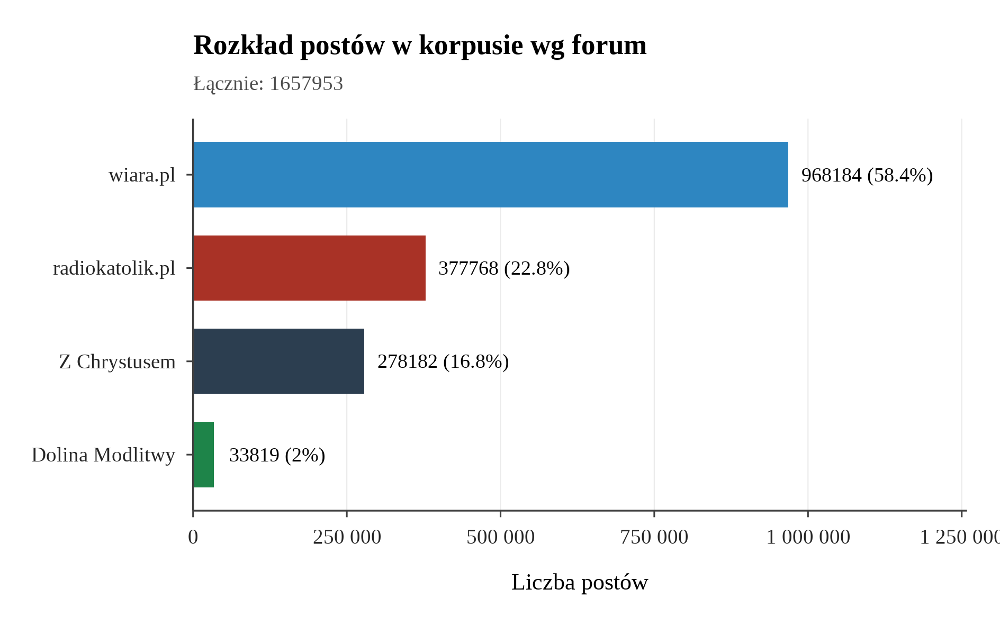
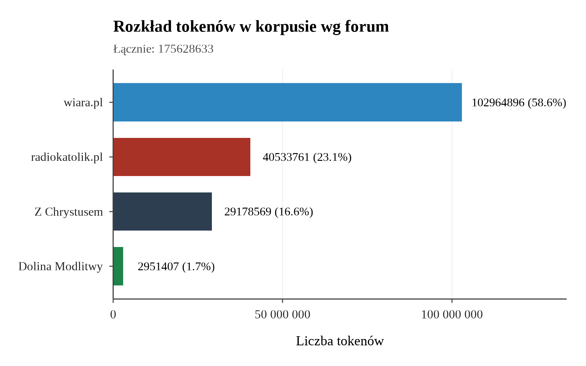
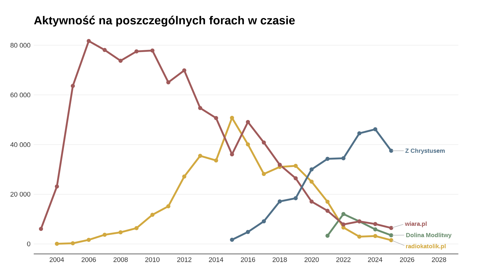
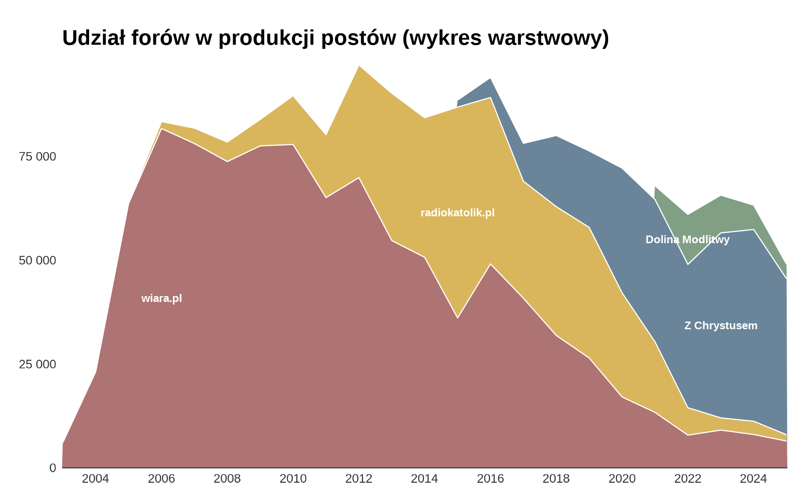
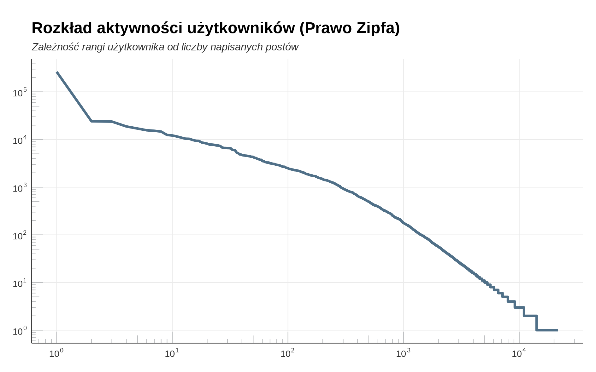
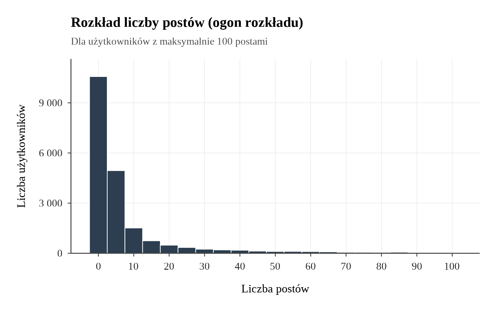
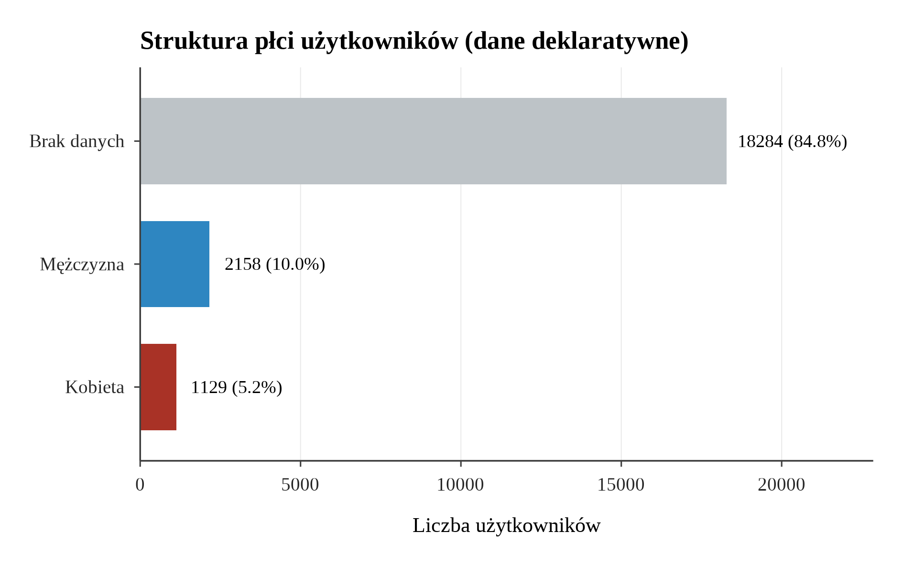
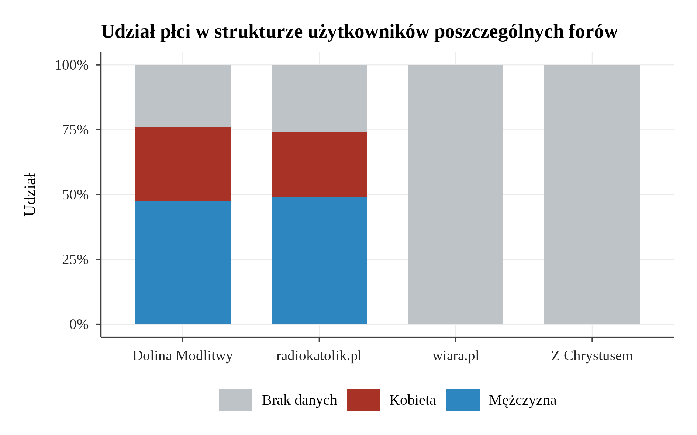

# Opisowa analiza statystyczna korpusu forów internetowych

> Raport wygenerowany automatycznie: 2026-02-12 18:17:39.722535

---

## 1. Informacje ogólne

Korpus składa się z danych zebranych z **4 forów internetowych** o tematyce religijnej.
Łącznie baza zawiera **1657953 postów**, **175628633 tokenów**
(po analizie morfologicznej LPMN), **38718 wątków** oraz
**21571 użytkowników**.

### 1.1 Podsumowanie korpusu wg forum

| Forum | Posty | Wątki | Użytkownicy | Tokeny | % postów | % tokenów |
|---|---:|---:|---:|---:|---:|---:|
| wiara.pl | 968184 | 25007 | 15124 | 102964896 | 58.4% | 58.63% |
| radiokatolik.pl | 377768 |  4368 |  3941 |  40533761 | 22.79% | 23.08% |
| Z Chrystusem | 278182 |  7628 |  2030 |  29178569 | 16.78% | 16.61% |
| Dolina Modlitwy |  33819 |  1715 |   476 |   2951407 | 2.04% | 1.68% |
| **RAZEM** | **1657953** | **38718** | **21571** | **175628633** | **100%** | **100%** |

### 1.2 Rozkład postów wg forum

### 1.3 Rozkład tokenów wg forum

---

## 2. Analiza czasowa (diachronia)

Zakres czasowy korpusu: **2003-05-14** -- **2025-12-31**.

### 2.1 Liczba postów w poszczególnych latach

| Rok | Liczba postów |
|---:|---:|
| 2003 |  6074 |
| 2004 | 23213 |
| 2005 | 63904 |
| 2006 | 83353 |
| 2007 | 81790 |
| 2008 | 78430 |
| 2009 | 83882 |
| 2010 | 89601 |
| 2011 | 80222 |
| 2012 | 97007 |
| 2013 | 90192 |
| 2014 | 84295 |
| 2015 | 88542 |
| 2016 | 93991 |
| 2017 | 78127 |
| 2018 | 80015 |
| 2019 | 76297 |
| 2020 | 72158 |
| 2021 | 67927 |
| 2022 | 61029 |
| 2023 | 65654 |
| 2024 | 63254 |
| 2025 | 48996 |

### 2.2 Dynamika postów (wykres liniowy)

### 2.3 Dynamika postów wg forum

### 2.4 Wykres warstwowy

---

## 3. Analiza demograficzna użytkowników

### 3.1 Rozkład aktywności (prawo Zipfa)

Aktywność użytkowników wykazuje typowy rozkład potęgowy (prawo Zipfa):
- **Top 1%** użytkowników (216) napisało **63.8%** wszystkich postów.
- **Top 10%** użytkowników (2 158) napisało **93.4%** wszystkich postów.

#### Kwantyle aktywności (posty na użytkownika)

| Kwantyl | Liczba postów |
|---|---:|
| Min | 1 |
| Q1 (25%) | 1 |
| Mediana | 3 |
| Średnia | 76 |
| Q3 (75%) | 9 |
| P90 | 49 |
| P95 | 159 |
| P99 | 1391 |
| Max | 262981 |

#### Wykres log-log (prawo Zipfa)

#### Histogram aktywności

### 3.2 Rozkład płci

#### Płeć deklarowana (pole `users.gender`)

| Płeć | Liczba | % |
|---|---:|---:|
| Kobieta |  1129 | 5.2% |
| Mężczyzna |  2158 | 10.0% |
| Brak danych | 18284 | 84.8% |

#### Struktura płci wg forum

---

## 4. Pliki źródłowe

Wszystkie skrypty analityczne znajdują się w katalogu `scripts/`:

| Skrypt | Opis |
|---|---|
| `00_setup_theme.R` | Motyw graficzny i funkcje pomocnicze |
| `01_fetch_data.R` | Pobranie danych z bazy PostgreSQL |
| `02_general_stats.R` | Statystyki ogólne korpusu |
| `03_temporal_stats.R` | Analiza czasowa (diachronia) |
| `04_demographic_stats.R` | Demografia i aktywność użytkowników |
| `05_generate_markdown_report.R` | Generacja niniejszego raportu |

Wyniki zapisane są w:
- `output/tables/` -- tabele CSV i Excel
- `output/plots/` -- wykresy PNG i PDF

---

*Raport wygenerowany na potrzeby rozprawy doktorskiej.*
